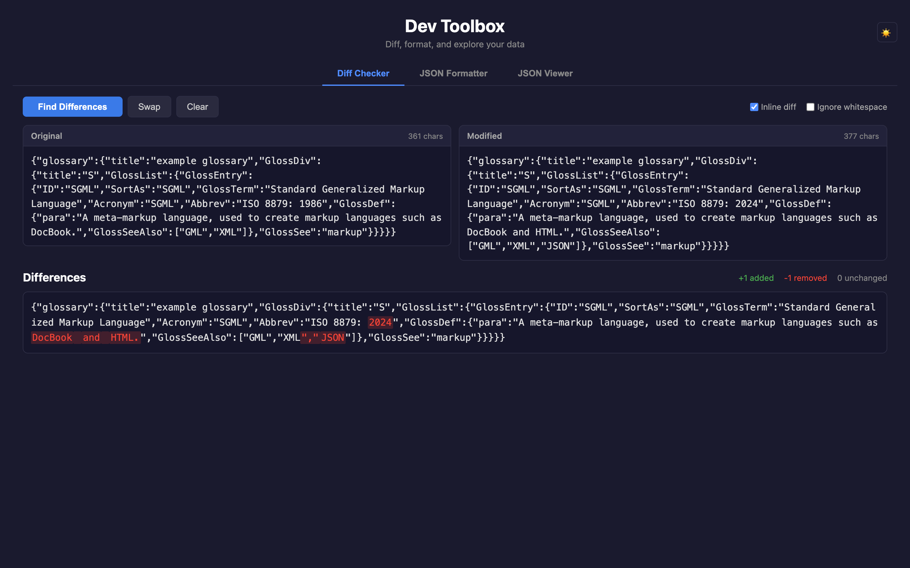
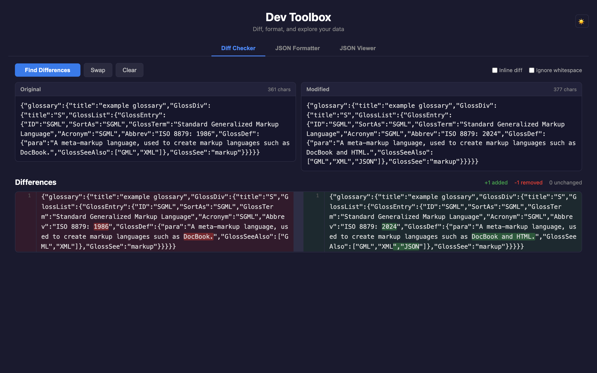
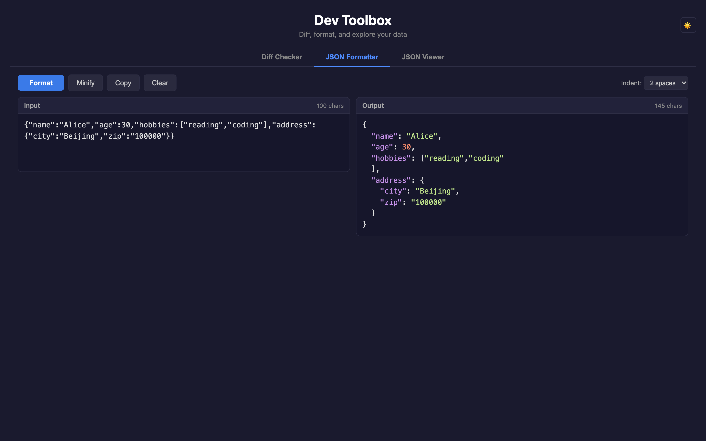
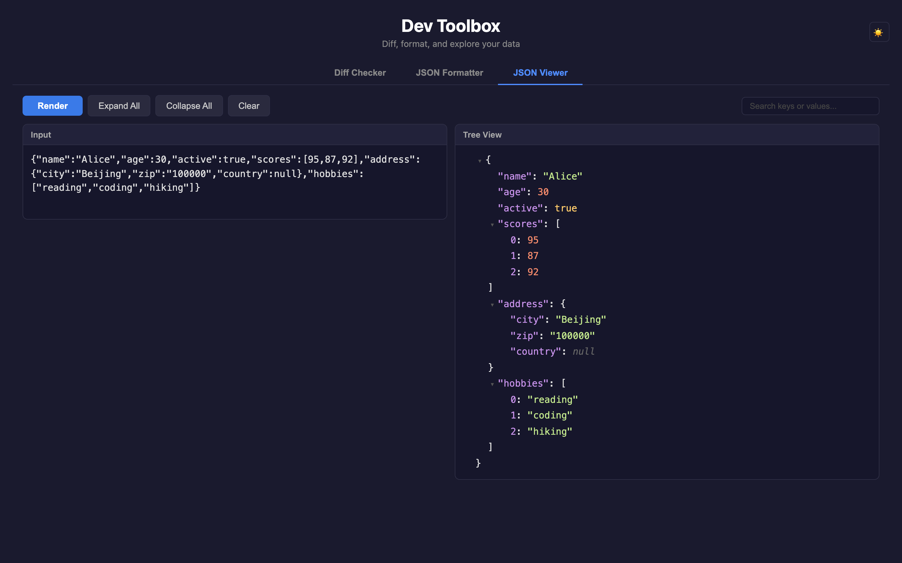
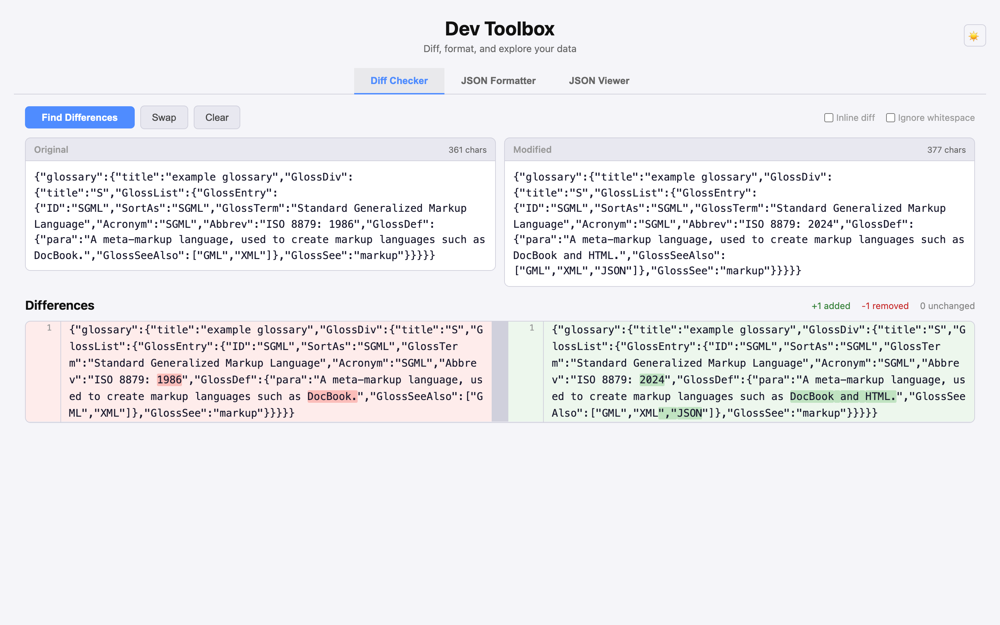

# Dev Toolbox

A lightweight, zero-dependency web toolkit for comparing text, formatting JSON, and exploring JSON structures. Built with vanilla HTML/CSS/JS, deployed with Docker + Nginx.


## Features

### Diff Checker

Compare two blocks of text and instantly see what changed.

- **Inline diff** (default): merged single-column view, changed characters highlighted in red
- **Side-by-side diff**: left (removed) vs right (added), with character-level highlighting
- **Ignore whitespace** option
- **Swap / Clear** buttons
- Keyboard shortcut: `Cmd/Ctrl + Enter` to run diff





### JSON Formatter

Format or compress JSON with one click.

- **Format**: pretty-print with syntax highlighting (keys, strings, numbers, booleans, null)
- **Minify**: compress to a single line
- Configurable indent: 2 spaces / 4 spaces / Tab
- **Copy** output to clipboard



### JSON Viewer

Interactive tree view for exploring JSON data.

- Collapsible nodes with `{3 keys}` / `[5 items]` summaries
- Syntax-highlighted values (strings, numbers, booleans, null)
- **Expand All / Collapse All**
- **Search**: real-time filter by key or value, with match highlighting
- **Click to copy** JSON path (e.g. `$.data.items[0].name`)



### Theme

- Light / Dark mode toggle
- Defaults to system preference (`prefers-color-scheme`)
- Remembers your choice via `localStorage`

| Light | Dark |
|-------|------|
|  |  |

## Quick Start

### Docker Compose (recommended)

```bash
git clone git@github.com:weijing24/devtools.git
cd devtools
docker compose up -d
```

Open http://localhost:8080

### Rebuild after changes

```bash
docker compose up -d --build
```

### Stop

```bash
docker compose down
```

### Without Docker

Just open `index.html` in your browser. No build step required.

## Project Structure

```
.
├── index.html            # Main page with tab navigation
├── style.css             # All styles with CSS custom properties for theming
├── app.js                # Theme, tabs, diff checker logic
├── diff.js               # Myers diff algorithm + character/word-level diff
├── json-formatter.js     # JSON format / minify / syntax highlight
├── json-viewer.js        # Interactive tree builder, search, path copy
├── favicon.svg           # Tab icon
├── Dockerfile            # Nginx Alpine image
├── docker-compose.yml    # One-command deployment with healthcheck
└── screenshots/          # Screenshots for README
```

## Example

### Diff Checker

Paste original text on the left, modified text on the right, click **Find Differences**:

**Original:**
```json
{"name":"Alice","age":30,"city":"Beijing"}
```

**Modified:**
```json
{"name":"Alice","age":31,"city":"Shanghai"}
```

**Result** (inline): the values `30` -> `31` and `Beijing` -> `Shanghai` are highlighted in red.

### JSON Formatter

Input:
```
{"name":"Alice","age":30,"hobbies":["reading","coding"],"address":{"city":"Beijing","zip":"100000"}}
```

Click **Format** (2 spaces):
```json
{
  "name": "Alice",
  "age": 30,
  "hobbies": [
    "reading",
    "coding"
  ],
  "address": {
    "city": "Beijing",
    "zip": "100000"
  }
}
```

Click **Minify** to compress back to one line.

### JSON Viewer

Paste any JSON and click **Render** to get an interactive tree:

```
$.name         → "Alice"
$.age          → 30
$.hobbies      → [2 items]
  $[0]         → "reading"
  $[1]         → "coding"
$.address      → {2 keys}
  $.city       → "Beijing"
  $.zip        → "100000"
```

- Click any node to copy its JSON path
- Use the search box to filter by key or value

## Tech Stack

- **Frontend**: Vanilla HTML5 + CSS3 + ES6+ JavaScript
- **Diff Algorithm**: Myers diff (line-level) + LCS (character-level) + word-level fallback for long lines
- **Deployment**: Nginx on Alpine Linux
- **Dependencies**: None
